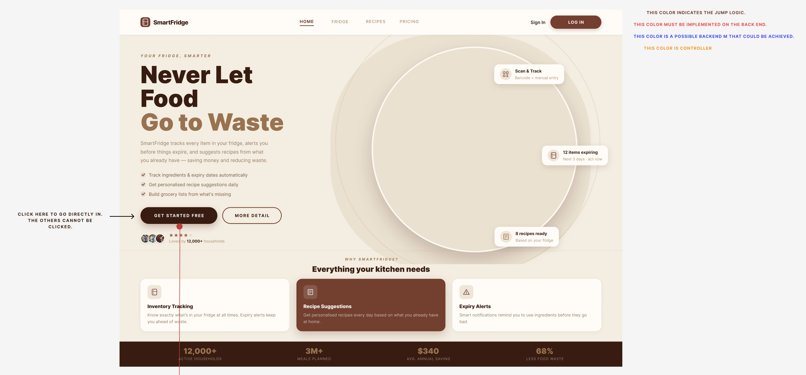
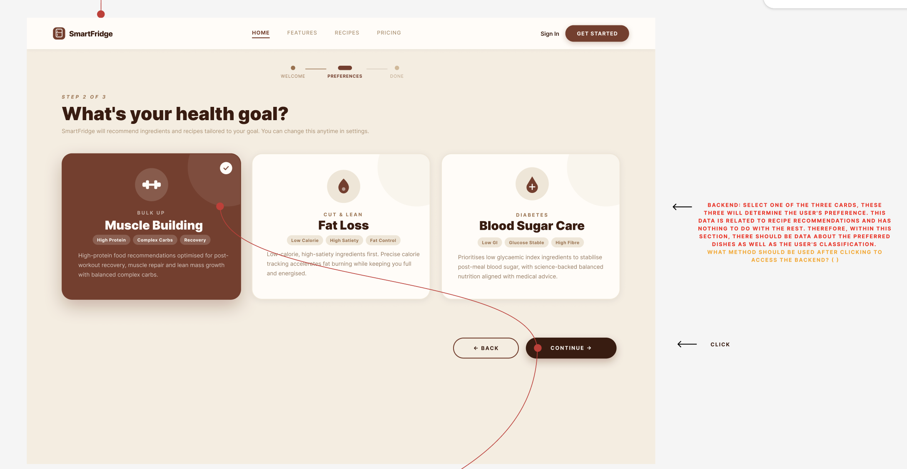
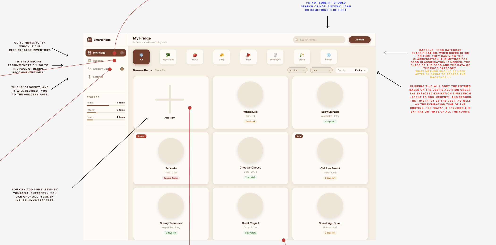
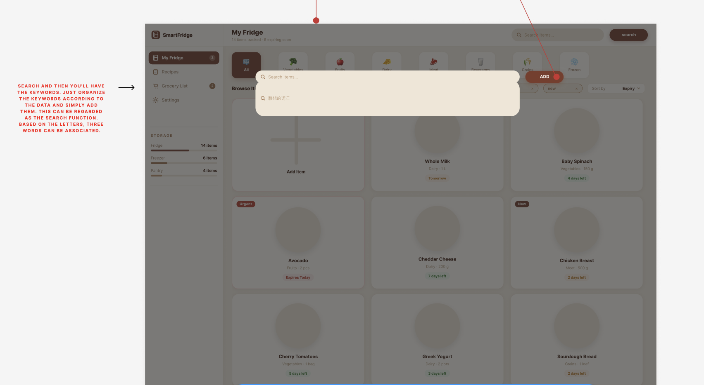
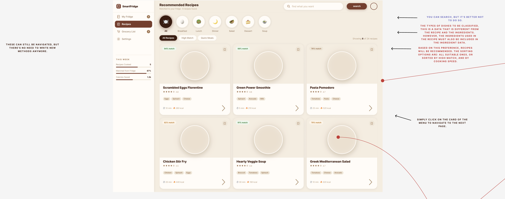
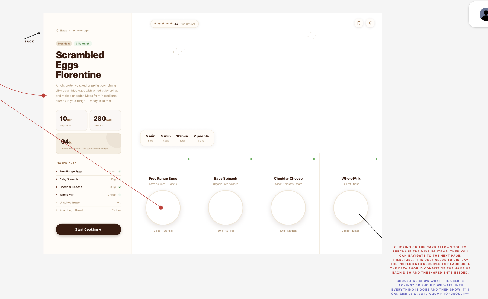
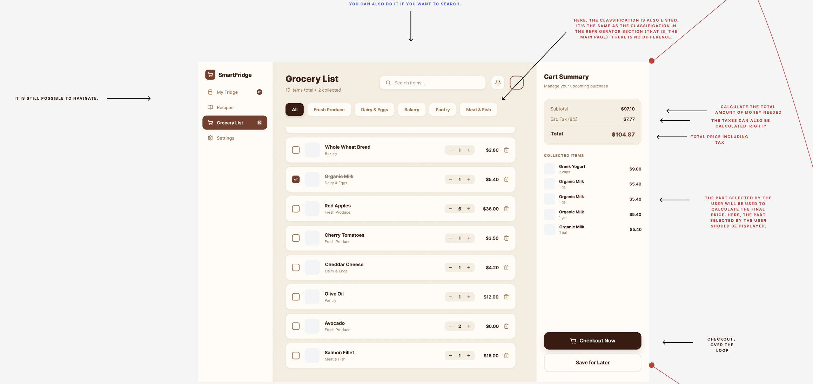

# Manual 

You will update this manual and add any files here that you need for an 'application' manual for your program. Make sure to include screenshots of various features.

# 🍎 SmartFridge User Manual

> **Your Fridge, Smarter.** Our mission is to eliminate food waste and optimize nutrition.

## Getting Started

### 1. Account Setup
To begin your journey, click the **GET STARTED FREE** button on the landing page.
* **Set Your Profile**: Follow the onboarding steps to help us understand your needs.

* **Define Your Health Goal**: You will be prompted with *"What's your health goal?"* Select a path such as:
    * **Muscle Building**: High protein, complex carbs, and recovery-focused.
    * **Healthy Living**: Balanced nutrition and fresh ingredients.
    * **Weight Management**: Low-calorie, nutrient-dense suggestions.

### 2. Inventory Management
Keeping your fridge updated is the core of the SmartFridge experience:
* **Automatic Sync**: Link your smart appliances to track ingredients & expiry dates automatically.
* **Manual Log**: Add items manually by entering the name and purchase date.

### 3. Recipe Suggestions
* **Personalized Cooking**: Get daily recipe suggestions based on what you already have.
* **Waste Reduction**: Our algorithm prioritizes ingredients near their expiry date to ensure nothing goes to waste.

### 4. Grocery Lists
* **Auto-Generation**: Build grocery lists instantly from what is missing in your pantry or fridge based on your set goals.
